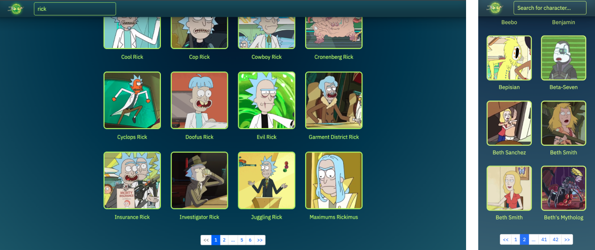

# Welcome to Appspace React FE Challenge

## About project

### Implemented 
1. Responsive design. (Mobile first, tablet and desktop view)
2. Used Styled Components for CSS.
3. Implemented loading animation. 
4. **React router V6**, for:
- Page not found
- Routing to home page from header icon.
5. Implemented search bar, which filters characters by name.
6. Paginated list of items (**Used React Paginate package**):
- Shows all pages for non filtered characters.
- Shows all pages related to filtered charactes by name.
- Have button for previous and next page.
- Have numbered buttons, so you can go to last or first one.
7. For pagination and filtering implemented **URL Search Params**:
- Which works and updates when you search for character.
- It updates when you change to different page.
---

### Overview

Main focus was for Url Search Params. It took most of time to handle that it will be dinamically updated when you use search or changing pages.
Played a bit with CSS animations, so when you hover over the characher card, it flips and displays info about character.


---

### Things I had in mind
To biuld navigation with more options, and more search filters. But I took a path to make a fully working Url serch params function.

---
## Screenshots

Desktop and mobile view

<p align="center">

</p>

---

## Getting Started

1. Clone repo

```
git clone https://github.com/Jonas-Petrauskas/appspace-frontend.git
```

2. Install dependencies

```
Yarn install
```

3. Start the project

```
go to -> src file | yarn start
```


---

## Developed by

Jonas Petrauskas - [GitHub](https://github.com/Jonas-Petrauskas) - [LinkedIn](https://www.linkedin.com/in/jonas-petrauskas-78038894/)
